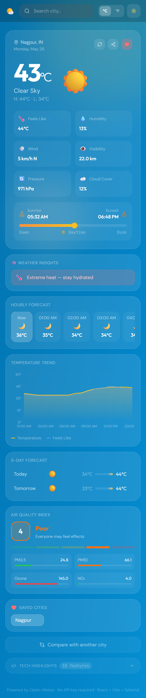
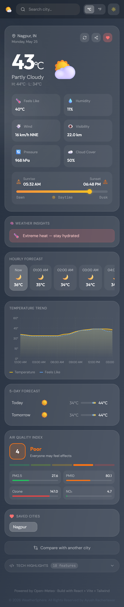
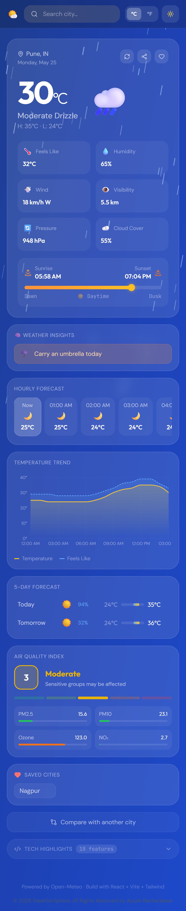
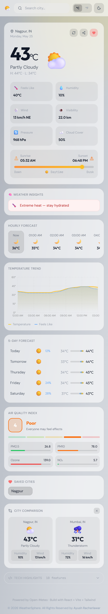

# 🌤️ WeatherSphere - Modern Weather Dashboard

A modern, responsive, and visually immersive weather dashboard inspired by the clean simplicity of Google Weather and the premium UI experience of Apple Weather.

<p align="center">
  
</p>

<p align="center">
  
</p>

<p align="center">
  
  
  
  
  
  
  
</p>

Built with React, Tailwind CSS, Recharts, Vite and Open-Meteo APIs, this project demonstrates real-world frontend engineering skills including API integration, responsive UI design, geolocation, charts, animations, local storage, and performance optimization.

<p align="center">
  
</p>


## 🚀 Live Demo

> https://your-weather-app.vercel.app

## 📸 Screenshots

<table align="center">
  <tr>
    <td align="center">
      
      <br><b>Dashboard</b>
    </td>
    <td align="center">
      
      <br><b>Weather Condition</b>
    </td>
  </tr>

  <tr>
    <td align="center">
      
      <br><b>Rainy Weather</b>
    </td>
    <td align="center">
      
      <br><b>Light Mode</b>
    </td>
  </tr>
</table>


# ✨ Features

## 🌍 **Real-Time Weather Data**
- Current weather conditions 🌡️
- Real-time temperature updates
- Feels-like temperature
Humidity, visibility, pressure
- Wind speed & direction
- Sunrise & sunset timings

## 📅 **5-Day Forecast**
- Hourly forecast cards
- Daily weather forecast
- Dynamic weather icons
- Smooth animated transitions

## 📊 **Temperature Trend Graph** — Animated area chart with Recharts
- Interactive weather charts using Recharts
- Temperature visualization
- Responsive graph animations

## 📍 **Geolocation**
- Auto-detect user location
- Browser geolocation integration
- Default fallback city support

## 🧠 **AI Insights** 
### 💡Smart weather tips and alerts :

- “Carry an umbrella today”
- “Perfect weather for outdoor activities”
- “High UV levels expected”
- “Strong winds likely in evening”

## 💨 **Air Quality Index (AQI)**
- AQI status indicator
- Pollution level indicator
- Health recommendation badges

## ❤️ **Favorites Cities**
- Save favorite locations
- Persistent localStorage support
- Quick access weather cards

## 🕐 **Recent Searches**
- Maintain city search history
- Fast location switching

## ⚖️ **City Comparison**
- Compare two cities side-by-side

## 🌙 **Dark/Light Mode** 
- Animated theme switching
- Smooth transitions
- Persistent user preferences

## 🌧️ **Animated Background**  
Rain, snow, stars, sunny effects per weather

## 🌅 **Sunrise/Sunset** 
- Live animated progress bar

## 🎨 **Premium UI/UX**
- Apple Weather inspired glassmorphism
- Google Weather inspired clean layouts
- Dynamic animated backgrounds
- Weather-based gradients
- Floating weather particles
- Skeleton loading states

## ⚡ Performance Optimizations
- Debounced city search
- Lazy loading
- Optimized API requests
- Error boundaries
- Cached responses

## 🛠️ Tech Stack
### Frontend
- React
- Vite
- Tailwind CSS
- Recharts
- Framer Motion
- Lucide React
### APIs
- Open-Meteo API
- Open-Meteo Geocoding API
- Browser Geolocation API


# 📦 Installation

### Clone the repository:

> git clone https://github.com/ayushracherlawar-ai/weathersphere.git

### Move into the project directory:

> cd weathersphere

### Install dependencies:

> npm install

## ▶️ Run Locally

### Start the development server:

> npm run dev

The app works without an API key using fallback demo data.

## 🌐 Open-Meteo APIs Used
### Weather Forecast API

Used for:
- current weather
- hourly forecast
- daily forecast
- temperature trends

### Geocoding API

Used for:

- converting city names into coordinates

## 📁 Project Structure

```
src/
├── components/
│   ├── cards/       # WeatherCard, ForecastCard, AQICard, Insights...
│   ├── charts/      # WeatherChart (Recharts)
│   ├── effects/     # WeatherBackground particle animations
│   └── ui/          # SearchBar, ThemeToggle, Skeleton, Icons
├── context/         # WeatherContext global state
├── hooks/           # useGeolocation, useDebounce
├── pages/           # Dashboard layout
├── services/        # weatherApi.js + fallback data
└── utils/           # helpers.js — formatters, theming, insights
```

## 🛠️ Tech Stack

React 18 + Vite · Tailwind CSS v3 · Recharts · Lucide React · Axios · Open-Meteo API

## 🧠 Key Concepts Demonstrated

This project showcases:

- REST API Integration
- React Hooks
- State Management
- Responsive Design
- Data Visualization
- Geolocation API
- Local Storage
- Reusable Components
- Animation Systems
- Error Handling
- Modern UI/UX Engineering

## 📱 Responsive Design

Fully optimized for:

- Mobile Devices
- Tablets
- Laptops
- Large Screens
## 🌈 UI Inspiration

Inspired by:

- Google Weather
- Apple Weather
- Modern SaaS dashboards

## 🔥 Advanced Features
### Dynamic Weather Backgrounds

Backgrounds automatically change depending on:

- Rain
- Snow
- Clouds
- Clear Sky
- Night Mode

### Weather Comparison

- Compare weather between multiple cities side-by-side.

### Installable PWA
- Add to Home Screen
- Offline support
- Native app-like experience
---

## 🚧 Future Improvements
- Weather radar maps
- AI weather assistant
- Voice search support
- Multi-language support
- Severe weather notifications
- Historical weather analytics


## 👨‍💻 Author

**Ayush Racherlawar**

> © 2026 WeatherSphere. All Rights Reserved.

---

## 📄 License

This project is licensed under the [MIT License](LICENSE).

# ⭐ Why This Project Stands Out

This project is designed to:

- look visually impressive
- feel production-ready
- demonstrate modern frontend engineering
- showcase API integration skills
- highlight responsive UI/UX development

It combines:

- clean architecture
- reusable React components
- interactive data visualization
- animations
- geolocation
- real-time weather data
- premium frontend design

---
# ⭐ Support

If you liked this project:
- Star the repository ⭐
- Fork the project 🍴
- Share feedback 🚀
---